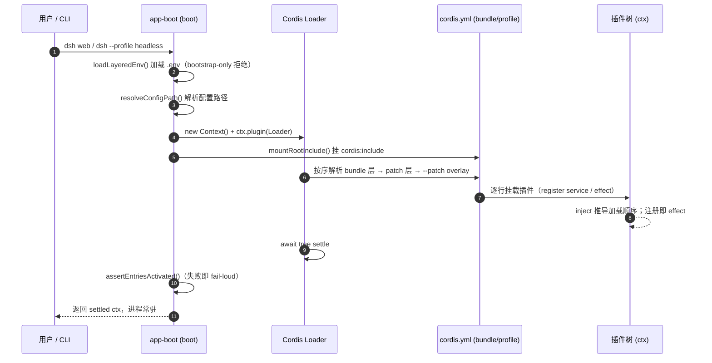
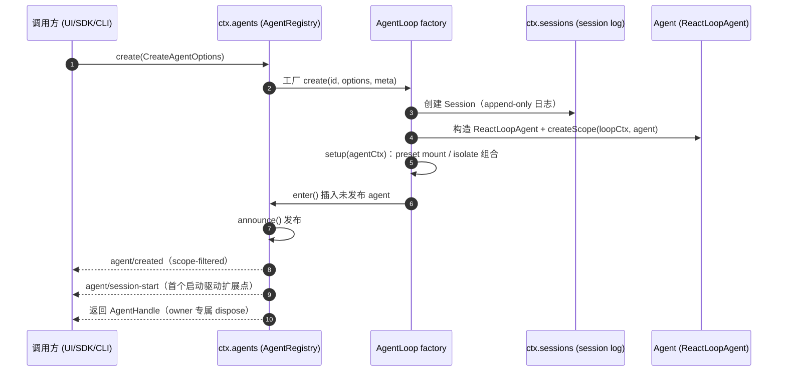
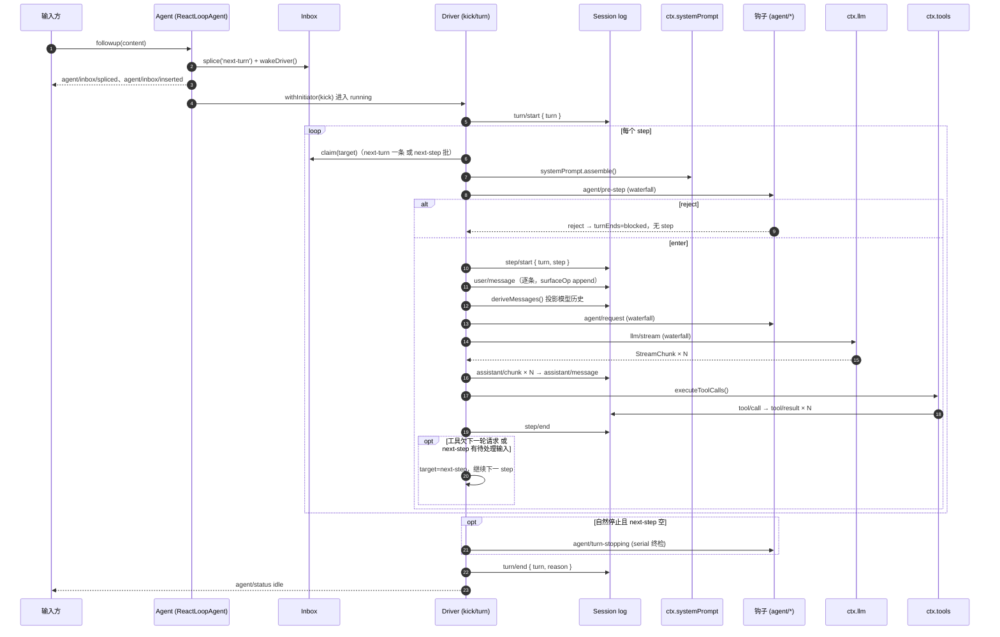
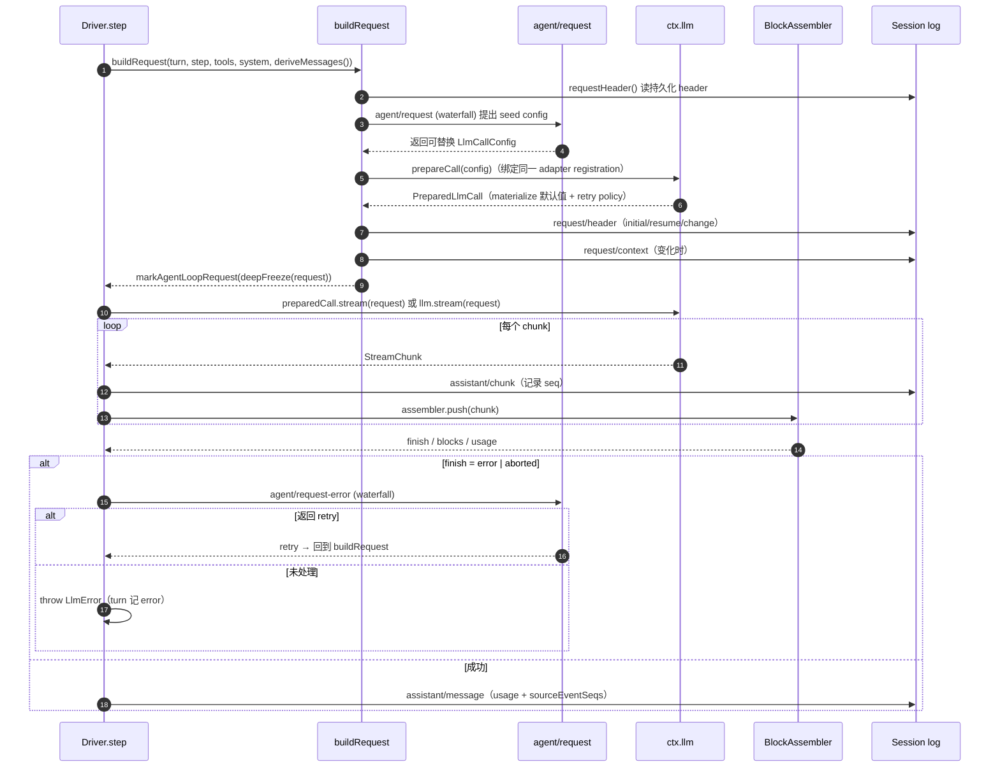
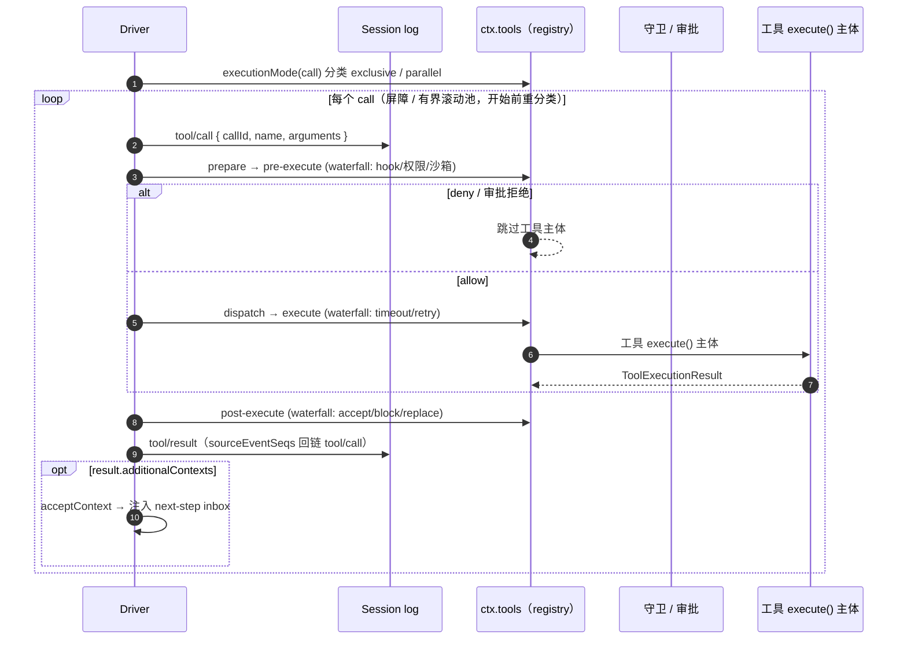

# 核心运行时主链路时序图

- **分析时间**：2026-08-15 14:18:41 CST
- **项目版本**：`0.1.0-rc.5`（commit `d4371f984d`）
- **代码依据**：`packages/boot/app-boot/src/index.ts`、`packages/core/agent-loop/src/agent.ts`、`packages/core/agent-loop/src/tool-calls.ts`
- **权威文档**：`docs/architecture.md`、`docs/agent-lifecycle.md`、`docs/tool-execution-pipeline.md`

## 定位

本文是 [overall-architecture.md](overall-architecture.md) 的时序图补充，把「核心运行时主链路」串成五张 Mermaid 时序图：**进程启动与组合 → 会话创建 → turn/step 循环 → 模型请求与流式 → 工具执行**。仓库自带的 `docs/agent-lifecycle.md` 是 turn/step 生命周期的精修时序图（由 `scripts/gen-doc-graphs.ts` 生成），本文按中文视角覆盖整条主链路，并在关键节点标注事件名与落日志位置。

文中事件分两类：**durable session 事件**（`turn/start`、`step/start`、`user/message`、`assistant/chunk`、`assistant/message`、`tool/call`、`tool/result`、`request/header` 等）追加到会话日志、可回放；**live 事件**（`agent/*`、`llm/stream`、`tools/*`、`system-prompt/assemble`）是运行中的拦截/协调点。`waterfall` 监听器必须调用 `next()` 委托，否则短路；`serial` 无 `next()`。

## 图 1 — 进程启动与组合（boot）

一次 `dsh web` / `dsh --profile headless` 启动：加载 `.env`（bootstrap-only 变量被拒绝，只能来自启动环境）、解析配置路径、挂载 Cordis Loader，再把 `cordis.yml` 的 bundle 层 → patch 层 → `--patch` overlay 按序组装成插件树。树「settle」后再审计每个 entry 是否激活，失败即 fail-loud。

## 图 2 — 会话创建与发布

`ctx.agents.create()` 走已注册的 `AgentFactory`（由 agent-loop 通过 `setFactory()` 注册）：mint 会话 id、准备 append-only Session、构造 `ReactLoopAgent` 并 `createScope`，再执行 `setup(agentCtx)` 组合 agent 局部世界（preset mount / isolate realm）。setup、commit 或 owner disposal 任一失败都会回滚，两个 id 均不发布。

## 图 3 — turn/step 主循环（核心）

这是产品的主循环，实现在 `ReactLoopAgent.turn()` / `preStep()` / `step()`。**turn** = 一次输入排空（零或多个 step），**step** = 一次模型请求 + 它引发的工具调用。关键语义：`agent/pre-step` 是唯一的串行决策点，可 reject 或改写进入的批次；首步 claim 后消息为空仍开一次「零 step」的 durable turn，记录这次尝试。

## 图 4 — 单次 step 的模型请求与流式

`step()` 内层 `while(true)` 循环 + `buildRequest()`：先经 `agent/request` waterfall 提出 config，再 `prepareCall()` 把一次调用绑定到同一个 adapter registration（materialize 精确模型默认值），随后落 `request/header`（initial/resume/change）与 `request/context`（变化时）。请求被 `deepFreeze` 并打上 process-local 标记；流式 chunk 既追加 `assistant/chunk` 又喂给 `BlockAssembler`。终态 `error`/`aborted` 走 `agent/request-error`，监听器返回 `retry` 才重试，否则抛 `LlmError` 并让 turn 记 `error`。

## 图 5 — 工具调用调度与执行

`executeToolCalls()` 按 `executionMode` 分类：**exclusive** 调用形成屏障，**parallel** 调用进入有界滚动池（上限 `maxParallelToolCalls`），开始前重新分类。调度可重叠，但策略、结果与结果上下文严格按模型顺序提交。执行本体走 registry 的三段瀑布 `tools/pre-execute` → `tools/execute`（around 派发，含 timeout/retry）→ `tools/post-execute`，其后 `finalizeContent` 与 `tools/result`。取消时为未启动调用补记合成错误结果，保证回放合法。

## 关键不变量

- **model-visible ⟺ logged**：任何进入模型请求的内容必须能从会话日志重构（运行时不变量强制）。`deriveMessages()` 从日志投影历史，`assistant/chunk` 保 token 级原始流，`assistant/message` 用 `sourceEventSeqs` 回链 chunk。
- **turn 是 durable commit/replay 边界**：崩溃恢复、fork 边界校验、审计事件的合法性都以 turn 为锚；`turn/end` 记粗粒度 `reason`（`completed`/`max-tokens`/`blocked`/`error`/`aborted`）。
- **事件域选型是第一个设计决策**：持久事实用 session 事件，在途拦截用 `agent/*`，接缝策略用 `tools/*`、`fs/*` 等 capability 事件。
- **waterfall 即 around-middleware**：不调用 `next()` 就是短路，策略监听器靠短路拥有决策权；只观察的监听器必须委托。

## 延伸阅读

- 更精确的 turn/step 事件时序与 retry/recovery 细节：`docs/agent-lifecycle.md`
- 工具管线中权限、沙箱、fs 守卫、result 重写、UI 渲染的完整流程：`docs/tool-execution-pipeline.md`
- 模型请求与流式协议的契约：`docs/subsystems/llm-streaming.md`
- 会话日志投影、fork/resume、请求可重构性：`docs/subsystems/session.md`
